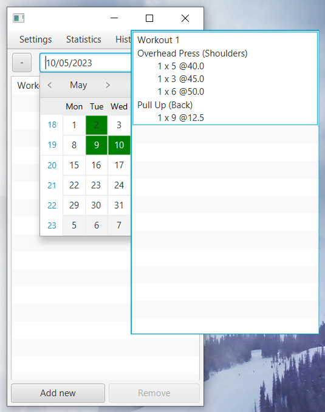

# Workout-Log

## Features
### Workout editor
- create/delete workouts and exercises
- edit workouts/exercises by double left clicking
- create exercise sets based on popular workout programs [Wendler 5/3/1](https://www.lift.net/workout-routines/wendler-5-3-1/) and [Smolov Jr](https://www.smolovjr.com/smolov-squat-program/)

### Calender
- see monthly distribution of workouts
- move between workouts by left-clicking a calendar cell with existing workout
- take a peek of a workout by hovering over a calendar cell
- copy previous workouts by right-clicking calendar cell with existing workout

### Exercise info editor
- create/delete/update exercise names and exercise categories
- group exercises with category for statistic purpose

### Cateory statistics
See variuos charts:
- weekly/monthly bar charts with with total sets and exercises by exercise category
- pie chart with total sets and exercises by exercises category 

### Exercise History
- view exercise history list
- view table of records for variuos repetition ranges
- view repetition records progression line graph

## Installation
